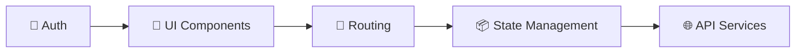
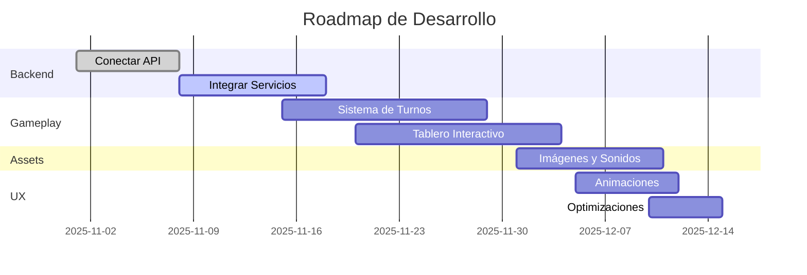

<div align="center">

# 🎮 PAISI 2025 - Cultura Huanuqueña

### Juego Interactivo de Trivia Educativa

<p align="center">
  
  
  
  
</p>

<p align="center">
  <strong>Descubre y aprende sobre la rica cultura de Huánuco a través de un juego de trivia interactivo</strong>
</p>

[Demo en Vivo](#) · [Reportar Bug](https://github.com/MerakT1/PAISI-2025-frontend/issues) · [Solicitar Feature](https://github.com/MerakT1/PAISI-2025-frontend/issues)

</div>

---

## ✨ Características Principales

<table>
<tr>
<td width="50%">

### 🎯 Gameplay

- 🎲 Sistema de tablero interactivo
- ❓ Preguntas de trivia cultural
- 🏆 Sistema de ranking en tiempo real
- 👤 Selección de personajes
- 🎨 Interfaz moderna con animaciones

</td>
<td width="50%">

### 🔧 Técnicas

- ⚡ Renderizado optimizado con React 19
- 🎭 Animaciones fluidas con Framer Motion
- 🔐 Autenticación JWT
- 📱 Diseño responsive
- 🌙 UI moderna con Glassmorphism

</td>
</tr>
</table>

## 🚀 Stack Tecnológico

<div align="center">

| Categoría | Tecnologías |
|-----------|------------|
| **Frontend** |   |
| **Build Tool** |  |
| **Styling** |  |
| **State** |  |
| **Routing** |  |
| **HTTP** |  |
| **Animation** |  |

</div>

## 📁 Estructura del Proyecto

```
src/
├── components/       # Componentes reutilizables
│   ├── layout/      # Layouts (AuthLayout, etc.)
│   └── ui/          # Componentes UI base (Button, Modal, Badge, etc.)
├── features/        # Características por módulo
│   ├── auth/        # Autenticación (LoginForm, RegisterForm)
│   ├── personajes/  # Selección de personajes
│   ├── preguntas/   # Sistema de trivia
│   ├── ranking/     # Leaderboard
│   └── tablero/     # Tablero de juego
├── pages/           # Páginas principales
│   ├── InicioSesion.tsx
│   ├── SeleccionPersonaje.tsx
│   ├── JuegoPrincipal.tsx
│   └── Ranking.tsx
├── services/        # Servicios de API
│   ├── api.ts              # Cliente Axios configurado
│   ├── authService.ts      # Endpoints de autenticación
│   ├── preguntasService.ts # Endpoints de preguntas
│   ├── personajesService.ts
│   └── rankingService.ts
├── store/           # Stores de Zustand
│   ├── useAuthStore.ts    # Estado de autenticación
│   ├── useJuegoStore.ts   # Estado del juego
│   └── useUIStore.ts      # Estado de UI (modales, notificaciones)
└── utils/           # Utilidades y helpers
```

## 🛠️ Instalación y Configuración

### 📋 Prerrequisitos

<table>
<tr>
<td></td>
<td></td>
</tr>
</table>

### ⚡ Inicio Rápido

```bash
# 1️⃣ Clonar el repositorio
git clone https://github.com/MerakT1/PAISI-2025-frontend.git
cd PAISI-2025-frontend

# 2️⃣ Instalar dependencias
npm install

# 3️⃣ Configurar variables de entorno
cp .env.example .env

# 4️⃣ Iniciar servidor de desarrollo
npm run dev
```

### 🔧 Variables de Entorno

Crea un archivo `.env` en la raíz del proyecto:

```env
VITE_API_URL=http://localhost:8000/api
```

> 🌐 El proyecto estará disponible en `http://localhost:5173`

## 📝 Scripts Disponibles

| Comando | Descripción |
|---------|-------------|
| `npm run dev` | 🚀 Inicia el servidor de desarrollo |
| `npm run build` | 📦 Compila el proyecto para producción |
| `npm run preview` | 👀 Previsualiza la versión de producción |
| `npm run lint` | 🔍 Ejecuta ESLint para verificar código |

## 🎯 Estado del Proyecto

<div align="center">

### ✅ Implementado



</div>

<table>
<tr>
<td width="50%">

#### ✅ Completado

- ✅ Sistema de autenticación JWT
- ✅ Rutas protegidas
- ✅ Stores de Zustand (Auth, Juego, UI)
- ✅ Componentes UI reutilizables
- ✅ Servicios de API con Axios
- ✅ Navbar responsive con glassmorphism
- ✅ Sistema de layouts (Auth, Main)

</td>
<td width="50%">

#### 🚧 En Desarrollo

- ⏳ Integración completa con backend
- ⏳ Sistema de preguntas y respuestas
- ⏳ Tablero de juego interactivo
- ⏳ Sistema de puntuación
- ⏳ Efectos de sonido
- ⏳ Assets visuales completos

</td>
</tr>
</table>

## 🎨 Componentes UI

<details>
<summary><b>🔘 Button</b></summary>

```tsx
<Button variant="primary" size="lg" onClick={handleClick}>
  Click me
</Button>
```

**Variantes:** `primary` `secondary` `danger` `success` `outline`  
**Tamaños:** `sm` `md` `lg`

</details>

<details>
<summary><b>🪟 Modal</b></summary>

```tsx
<Modal isOpen={isOpen} onClose={handleClose} title="Título">
  Contenido del modal
</Modal>
```

</details>

<details>
<summary><b>🏷️ Badge</b></summary>

```tsx
<Badge variant="success" size="md">Nivel 1</Badge>
```

</details>

<details>
<summary><b>👤 AvatarCircle</b></summary>

```tsx
<AvatarCircle src="/avatar.png" alt="Usuario" size="lg" border />
```

</details>

<details>
<summary><b>🧭 Navbar</b></summary>

```tsx
// Navbar flotante con glassmorphism y animaciones
// Características:
// - Responsive con menú hamburguesa
// - Menú de perfil desplegable
// - Fondo dinámico al hacer scroll
// - Animaciones con Framer Motion
```

</details>

## 💻 Uso del Sistema

### 🔐 Autenticación

```tsx
import { useAuthStore } from '@/store/useAuthStore'

const { login, logout, user, isAuthenticated } = useAuthStore()

// Login
await login(username, password)

// Logout
logout()
```

> 💡 Utiliza JWT tokens con persistencia en localStorage via Zustand

### 🎮 Gestión del Juego

```tsx
import { useJuegoStore } from '@/store/useJuegoStore'

const {
  personajeSeleccionado,
  jugadores,
  lanzarDado,
  responderPregunta
} = useJuegoStore()
```

### 🌐 Servicios API

```tsx
import { authService, preguntasService, rankingService } from '@/services'

// Obtener preguntas
const preguntas = await preguntasService.obtenerPreguntas({ 
  dificultad: 'medio' 
})

// Obtener ranking
const ranking = await rankingService.obtenerRanking()
```

> ⚡ Todos los servicios incluyen interceptores de Axios para manejo de tokens

## 🗺️ Roadmap



<details>
<summary><b>📋 Tareas Pendientes</b></summary>

- [ ] **Backend Integration**
  - [ ] Conectar endpoints reales
  - [ ] Manejo de errores
  - [ ] Sistema de caché
  
- [ ] **Gameplay**
  - [ ] Sistema de turnos
  - [ ] Movimiento en tablero
  - [ ] Lógica de preguntas
  - [ ] Sistema de puntos
  
- [ ] **Assets**
  - [ ] Avatares de personajes
  - [ ] Fondos temáticos
  - [ ] Efectos de sonido
  - [ ] Iconos personalizados
  
- [ ] **UX/UI**
  - [ ] Animaciones avanzadas
  - [ ] Feedback visual
  - [ ] Optimización móvil
  - [ ] Modo offline

</details>

---

## 👥 Contribuir

Las contribuciones son bienvenidas. Por favor:

1. Fork el proyecto
2. Crea una rama para tu feature (`git checkout -b feature/AmazingFeature`)
3. Commit tus cambios (`git commit -m 'Add some AmazingFeature'`)
4. Push a la rama (`git push origin feature/AmazingFeature`)
5. Abre un Pull Request

## 📄 Licencia

Este proyecto está bajo la Licencia MIT. Ver el archivo `LICENSE` para más detalles.

---

<div align="center">

**Desarrollado con ❤️ para la cultura Huanuqueña**

[](https://github.com/MerakT1/PAISI-2025-frontend/stargazers)
[](https://github.com/MerakT1/PAISI-2025-frontend/network/members)

</div>
import reactDom from 'eslint-plugin-react-dom'

export default defineConfig([
  globalIgnores(['dist']),
  {
    files: ['**/*.{ts,tsx}'],
    extends: [
      // Other configs...
      // Enable lint rules for React
      reactX.configs['recommended-typescript'],
      // Enable lint rules for React DOM
      reactDom.configs.recommended,
    ],
    languageOptions: {
      parserOptions: {
        project: ['./tsconfig.node.json', './tsconfig.app.json'],
        tsconfigRootDir: import.meta.dirname,
      },
      // other options...
    },
  },
])
```
# PAISI-2025-frontend
